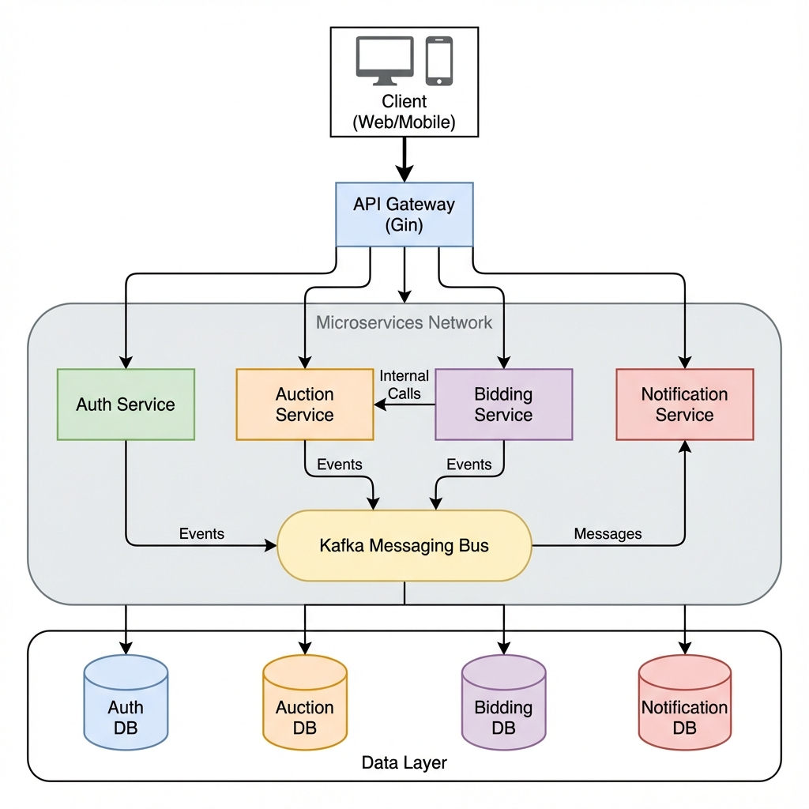
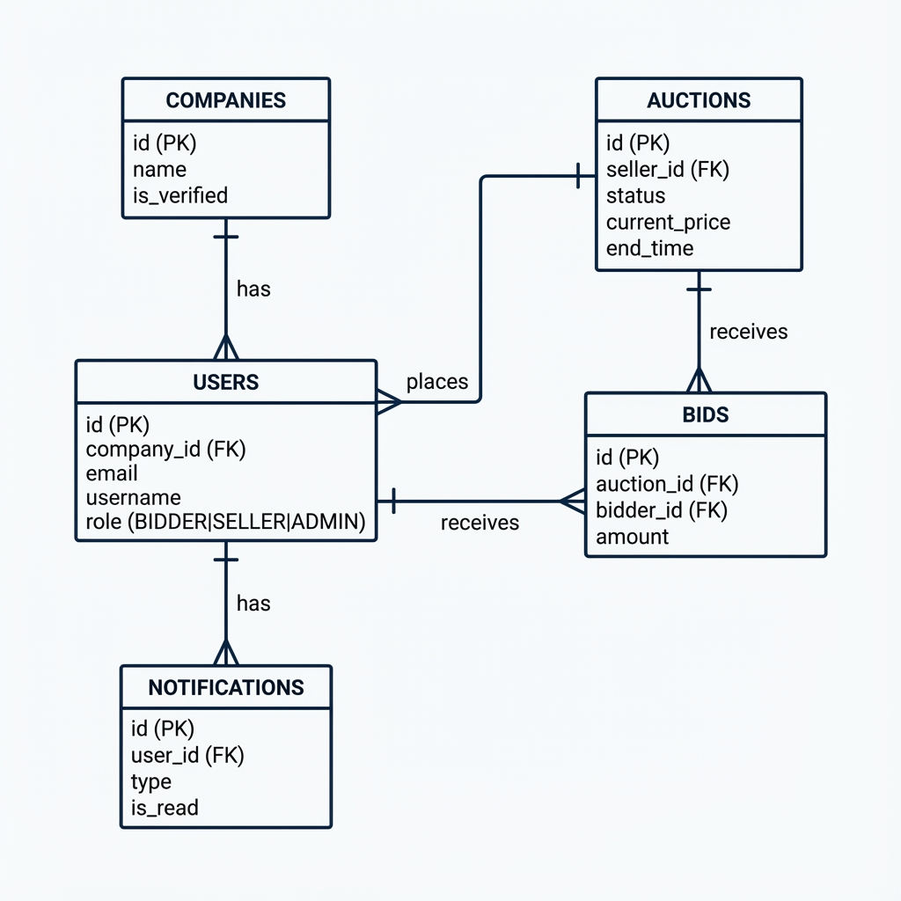

# BidFlow

## 📖 Project Description
BidFlow is a high-performance, distributed auction platform built with a microservices architecture. It allows users to list items for auction, place bids in real-time, and receive notifications about auction updates. The system is designed for scalability and reliability, utilizing modern technologies for synchronous and asynchronous communication.

## 🛠️ Technology Stack

### Backend
- **Language**: Go (Golang)
- **Framework**: Gin (HTTP/API Gateway)
- **Communication**: 
  - **Internal**: gRPC (Protobufs)
  - **External**: REST API
  - **Async**: Apache Kafka
- **Database**: PostgreSQL (Per-service database pattern)

### Infrastructure & DevOps
- **Containerization**: Docker & Docker Compose
- **Orchestration**: Kubernetes (Ready, configs in `infra/k8s`)
- **CI/CD**: GitHub Actions (implied)

## 🏗️ System Architecture

The system follows a microservices architecture where each domain is isolated in its own service. The API Gateway acts as the single entry point for external clients, routing requests to the appropriate microservices.



## 📂 Folder Structure

```
bidflow/
├── backend/
│   ├── common/             # Shared libraries (config, logger, errors)
│   ├── infra/              # Infrastructure configs (SQL, K8s)
│   ├── proto/              # Protobuf definitions
│   ├── services/           # Microservices source code
│   │   ├── api-gateway/    # HTTP Entry point
│   │   ├── auction/        # Auction management
│   │   ├── auth/           # specific user & auth logic
│   │   ├── bidding/        # Bidding logic
│   │   └── notification/   # Notification handler
│   ├── docker-compose.yaml # Local development setup
│   ├── Makefile            # Build and run commands
│   └── go.work             # Go workspace file
└── frontend/               # Frontend application (Planned)
```

## 💾 Database Design

Each service manages its own database schema to ensure loose coupling.

### Key Entities



## 📡 Service Communication

### Internal Communication (gRPC)
Services communicate synchronously using gRPC for critical operations.
- **Bidding Service** calls **Auction Service** to validate auction status before placing a bid.

### Asynchronous Communication (Kafka)
Events are published to Kafka topics to decouple services and trigger side effects (like notifications).

| Topic | Event | Producer | Consumer |
|-------|-------|----------|----------|
| `user.registered` | New user signup | Auth | Notification |
| `auction.created` | New auction listed | Auction | Notification |
| `bid.placed` | New bid accepted | Bidding | Notification |
| `auction.closed` | Auction time ended | Auction | Notification/Bidding |

## 🔄 Workflow

1.  **Registration**: User signs up via Auth Service. `user.registered` event triggers a welcome notification.
2.  **Create Auction**: Seller creates an auction. `auction.created` event is published.
3.  **Place Bid**: 
    - User places a bid via Bidding Service.
    - Bidding Service validates auction via gRPC.
    - Bid is saved, and `bid.placed` event is published.
    - Auction price is updated.
4.  **Notification**: Notification Service consumes events and sends alerts to relevant users.

## 🚀 How to Run

### Prerequisites
- [Docker](https://www.docker.com/) & Docker Compose
- [Go](https://go.dev/) 1.23+

### Steps

1.  **Clone the repository**
    ```bash
    git clone https://github.com/temesgen-abebayehu/bidflow.git
    cd bidflow/backend
    ```

2.  **Start the Infrastructure & Services**
    This command starts Kafka, Zookeeper, PostgreSQL, and all microservices.
    ```bash
    make up
    # OR directly via docker-compose
    docker-compose up -d
    ```

3.  **Verify Services**
    - **API Gateway**: `http://localhost:8080`
    - **Auth Service**: `http://localhost:8080/api/v1/auth`
    - **Auction Service**: `http://localhost:8080/api/v1/auctions`

4.  **Stop the System**
    ```bash
    make down
    ```

### Development Commands
- `make build`: Build all binaries.
- `make test`: Run unit tests for all services.
- `make tidy`: Clean up go modules.
